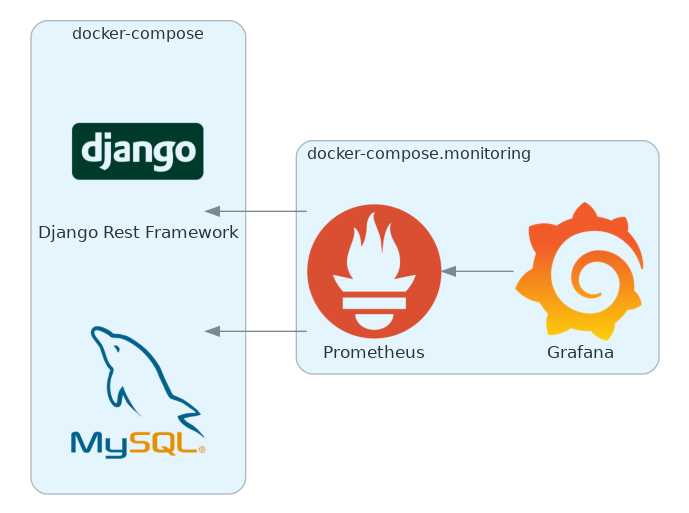

<h1 align="center"> djangorf-base </h1>  

# Introduction

**djangorf-base** is a Django project built with the aim of **avoiding boilerplate** and being used as the **base** of other projects to build **REST APIs** using django-rest-framework.

## Table of Contents

0. [Introduction](#introduction)
0. [Development](#development)
0. [Contributing](#family-contributing)
0. [License](#page_with_curl-license)

# Development

# Prometheus

## Some available metrics

- django_http_requests_body_total_bytes_bucket
- django_http_responses_body_total_bytes_bucket
- django_http_requests_latency_seconds_by_view_method_bucket
- django_http_requests_latency_including_middlewares_seconds_bucket

- prometheus_http_requests_total
- prometheus_http_request_duration_seconds_bucket
- prometheus_http_response_size_bytes_bucket

## PromQL queries examples

- sum(rate(django_http_requests_latency_seconds_by_view_method_bucket[30s])) BY (job, method)
- sum(rate(django_http_responses_body_total_bytes_bucket[30s])) by (job)

# Contributing

# License

This project is licensed under the [Apache license](https://github.com/eduardogr/evalytics/blob/main/LICENSE).
